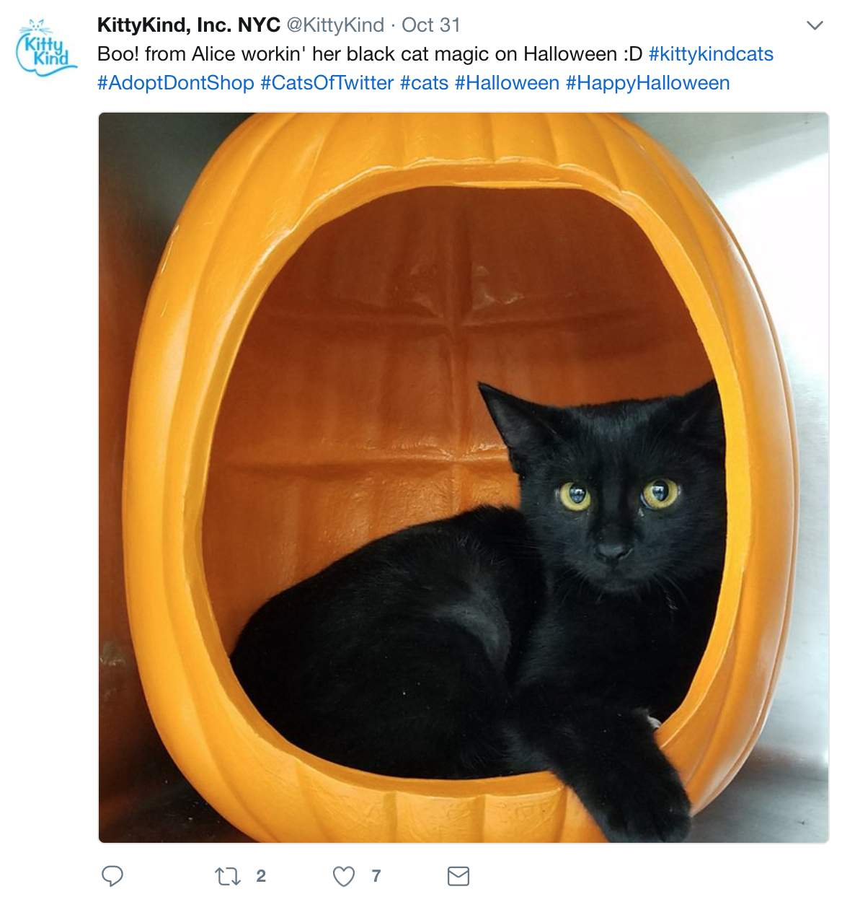
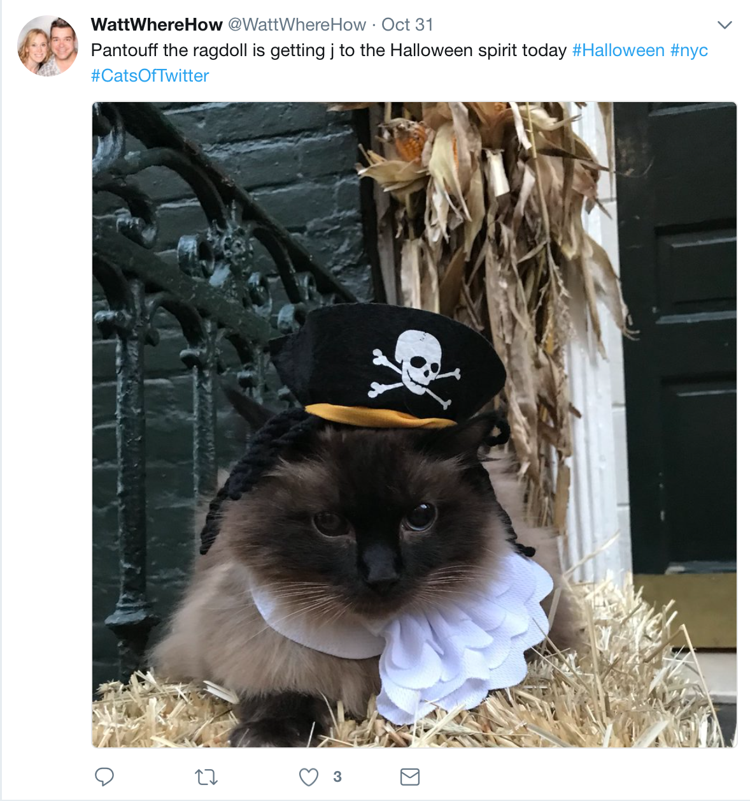
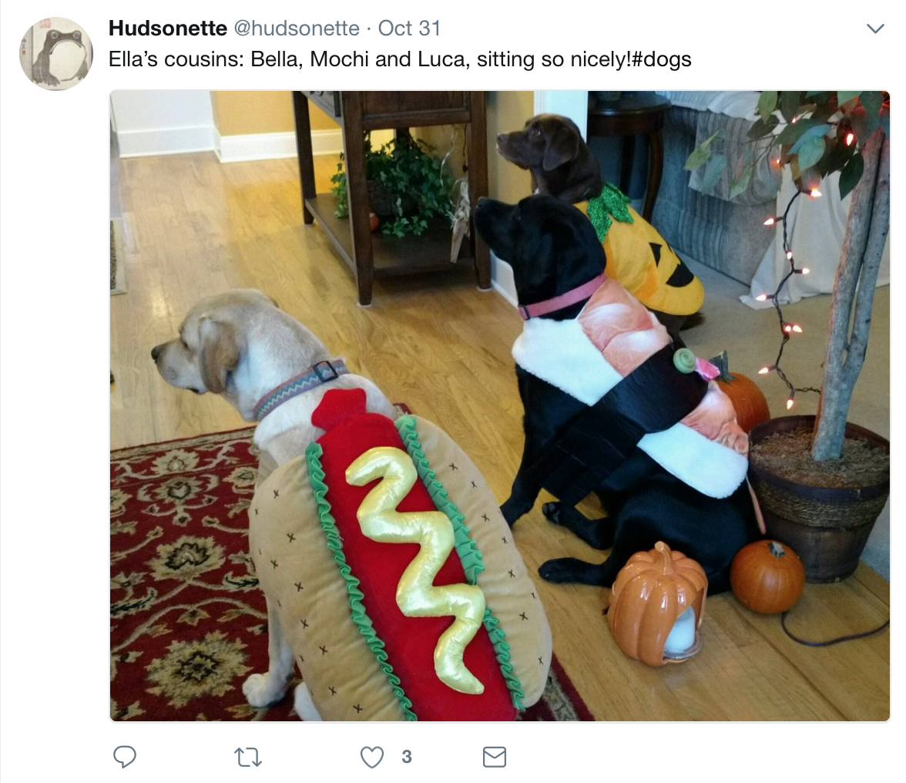
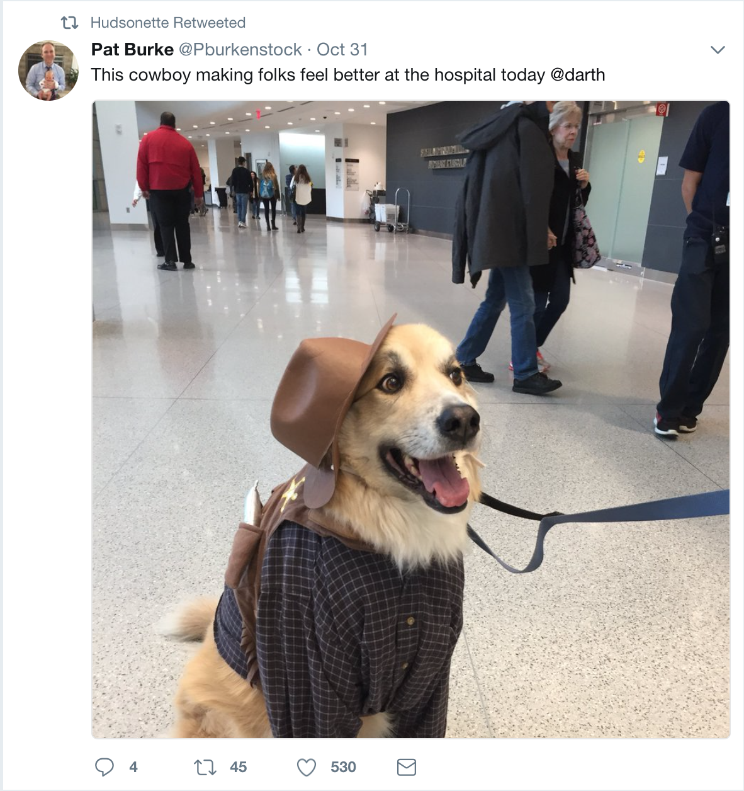
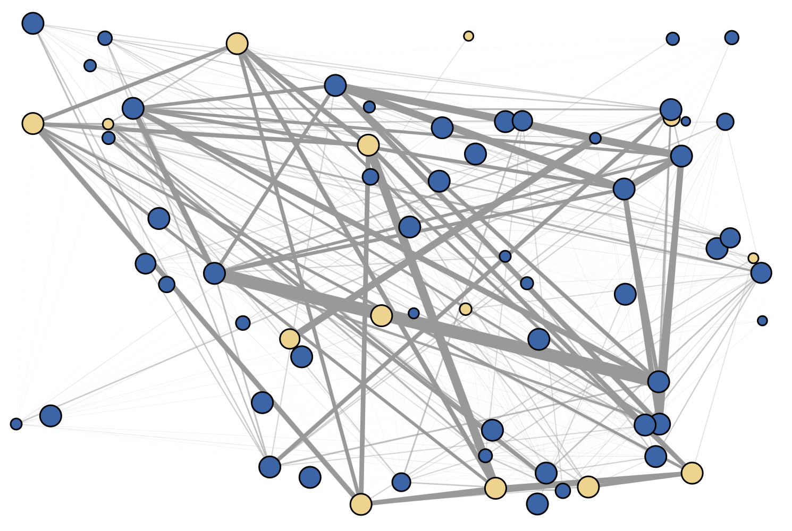
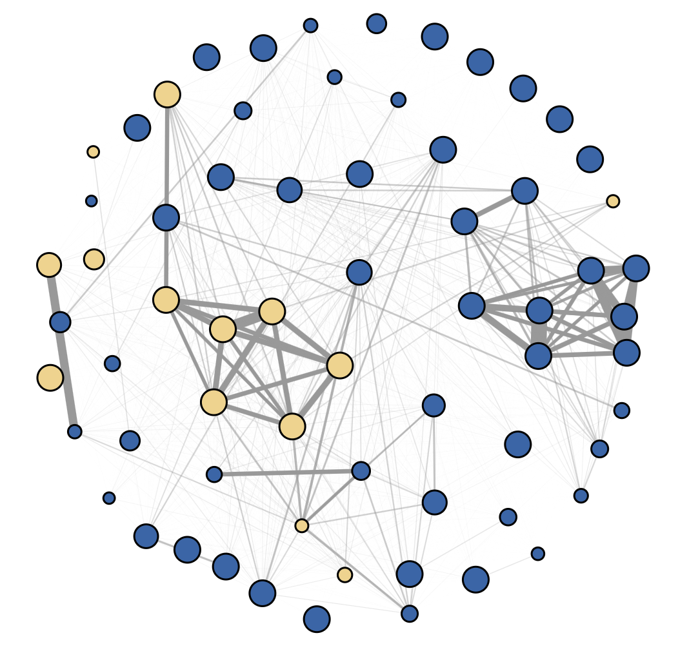

```{r setup, include=FALSE}
knitr::opts_chunk$set(echo = TRUE)
```

<br>

## Preface
Today, we'll do some network visualization with JavaScript and D3, using data from twitter on cat and dog-related Halloween tweets. Below is a sample of some of the data. :) 







<br>
<hr>

## Set up your html file ##
First, just set up the html and head:
```{html 1}
<html>
<head>
	<title>It's raining cats and dogs!</title>
```

This time, we'll use some CSS for styling as well:
```{html 2}
<style>
.node {
    stroke: #000;
    stroke-width: 1.5px;
}
.link {
    stroke: #999;
/*     stroke-opacity: .6; */
}

.node text {
/*   font: 14px helvetica; */
font-family: 'Lato', sans-serif;
}

	</style>
	
<link href='https://fonts.googleapis.com/css?family=Lato:400,900' rel='stylesheet' type='text/css'>
```

And, we also have to add the D3 library to our setup! We're using the version at d3js.org here, but you could just reference a local copy too.
```{html 3}
<script src="https://d3js.org/d3.v3.min.js"></script>
```
<script src="scripts/d3.v3.min.js"></script>

Last but not least, let's close the head and start the main body of the html:
```{html 4}
</head>
<body>
```

Everything we do below (unless we explicitly talk about editing the CSS or other stuff in the head), will go into the `<body>` section of the html.


<br>
<hr>

## Load the Data ##

Let's load the cat and dog data set (link to file [here](cat_dog_subnx.js)):
```{html load data}
<script src="cat_dog_subnx.js"></script>
```
<script src="cat_dog_subnx.js"></script>


(Discuss node and edge meanings together in class---open data set and talk over, explain co-followership, etc.)

<br>
<hr>

## Set up ##
Next, let's make a `<div>` where we'll put our visiualization
```{html div chart}
<div id = "chart"></div>
```

We'll use the `id` to grab this div later and add an SVG to it.

Now, let's make a new script and set up the SVG size:
```{html scriptsetup}
<script>

//Setup
var margin = {left:90, top:120, right:90, bottom:100},
	width = Math.min(window.innerWidth, 900) - margin.left - margin.right,
    height = Math.min(window.innerWidth, 700) - margin.top - margin.bottom;
```

We can make a color scheme that we'll use for our network nodes:
```{color}
var ourcolors = ["#555555","#EFD48B","#3963A8"];

var color = d3.scale.ordinal() //make color scale from colors above
    .domain(d3.range(ourcolors.length))
	.range(ourcolors);
```

<br>
<hr>

## Position the nodes ##
For the first visualization, let's place the nodes randomly. We'll loop through the nodes and add `x` and `y` values for their positions:
```{positions}
for(var i=0; i<graph.nodes.length; i++){
    graph.nodes[i].x = Math.random()*width;
    graph.nodes[i].y = Math.random()*height;
}
```

We'll use these position values to set where the node positions and link endpoints go. 

<br>
<hr>

## Draw the network ##
Okay, we have everything ready to go! Let's start drawing the network. We'll start by making the SVG:
```{svgsetup}
var svg = d3.select("#chart").append("svg")
    .attr("width", width + margin.left + margin.right)
    .attr("height", height + margin.top + margin.bottom);
```


Next, let's draw the links:
```{drawlinks}
var link = svg.selectAll(".link") //make links
    .data(graph.links)
    .enter().append("line")
    .attr("class", "link")
    .attr("x1", function (d) {return graph.nodes[d.source].x; })
    .attr("y1", function (d) {return graph.nodes[d.source].y; })
    .attr("x2", function (d) {return graph.nodes[d.target].x; })
    .attr("y2", function (d) {return graph.nodes[d.target].y; })
    .attr("stroke-opacity", function (d) {return Math.max(0.01,10*d.weight);})
    .style("stroke-width", function (d) {return 25*d.weight;});
```

And finally, we'll draw the nodes!
```{drawnodes}
var node = svg.selectAll(".node") //make nodes
    .data(graph.nodes)
    .enter().append("circle")
	.attr("r", function (d) {return 10*d.value;})
    .attr("cx", function (d,i) {return d.x})
    .attr("cy", function (d) {return d.y})
    .style("fill", function (d) {return color(d.community);})
```

(And, don't forget to close your script and html)
```{html close}
</script>

</body>
</html>
```




<br>
<hr>

## Force-directed layout ##

The random layout is okay, but hard to make sense of. Instead, we'll use a force-directed graph layout---this treats the links between nodes as physical connectors (like springs). For this, we'll need to replace the random placement of nodes and links with the following two code chunks.

First, right after we make the SVG we'll add:
```{force1}
var force = d3.layout.force()
    .charge(-300)
    .linkDistance(function (d) {return 400-(250*d.weight) - 100*(graph.nodes[0].community === graph.nodes[1].community ? 1:0);})//(200)
    .size([width, height]);

force.nodes(graph.nodes)
    .links(graph.links)
    .start();
```
Note the distance function---we can talk over why we picked this one in class.


And then at the end, we have to tell the force function how to update the visualization of the links and nodes at each timestep of the force layout:
```{force2}
force.on("tick", function () {   
    
    //positioning for links & nodes
    link.attr("x1", function (d) {
        return d.source.x;
    })
        .attr("y1", function (d) {
        return d.source.y;
    })
        .attr("x2", function (d) {
        return d.target.x;
    })
        .attr("y2", function (d) {
        return d.target.y;
    });

	d3.selectAll("circle").attr("cx", function (d) {
        return d.x;
    })
        .attr("cy", function (d) {
        return d.y;
    });
    d3.selectAll("text").attr("x", function (d) {
        return d.x;
    })
        .attr("y", function (d) {
        return d.y;
    });
});
```

<br>

You can see the updated code live [here](CatDogForceLayout.html)---now we get a nicer layout where nodes are grouped based on tie strength:<br>


<br>
<hr>

## Adding labels, communities, and interactivity ##
But, it might be nice to have some labels--maybe on the larger nodes? And let's add some node highlighting too while we're at it. [Here](CatDogForceLayoutLabelsHighlighting.html)'s the code--go over it together and adapt it for your code as well! You can also make the labels only appear when you mouseover---look up D3 tooltips and try it out if you like.

We might also want to group the nodes by community, so that cat and dog nodes tend to stick together. We can do that by adding attractive centers into the force calculations, where each community is pulled towards a different location in the SVG---see [here](CatDogForceLayoutCommunity.html) for example.

<br>
<hr>

## Other types of diagrams
Lastly, play with a couple of other diagrams! Here are two we can get started with, but there are plenty more on [bl.ocks.org](https://bl.ocks.org) to try too. 

- [Sankey Diagram](http://bl.ocks.org/d3noob/c9b90689c1438f57d649)

- [Hive Plot](https://bl.ocks.org/mbostock/2066415)

<br>
<hr>