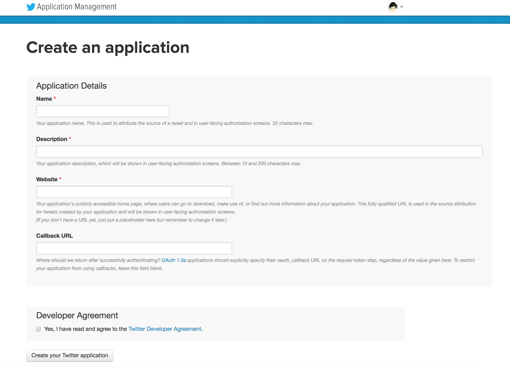
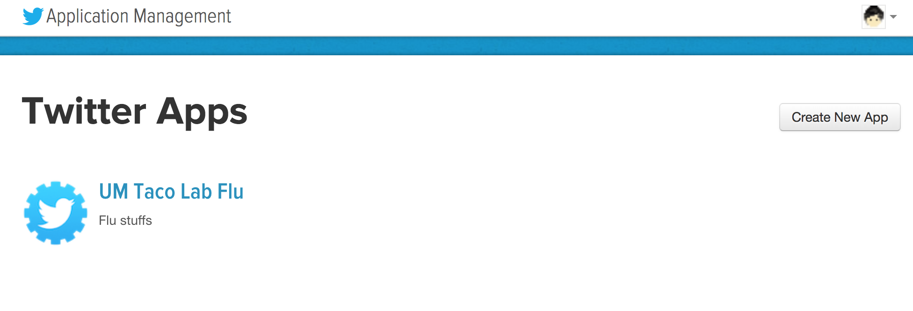
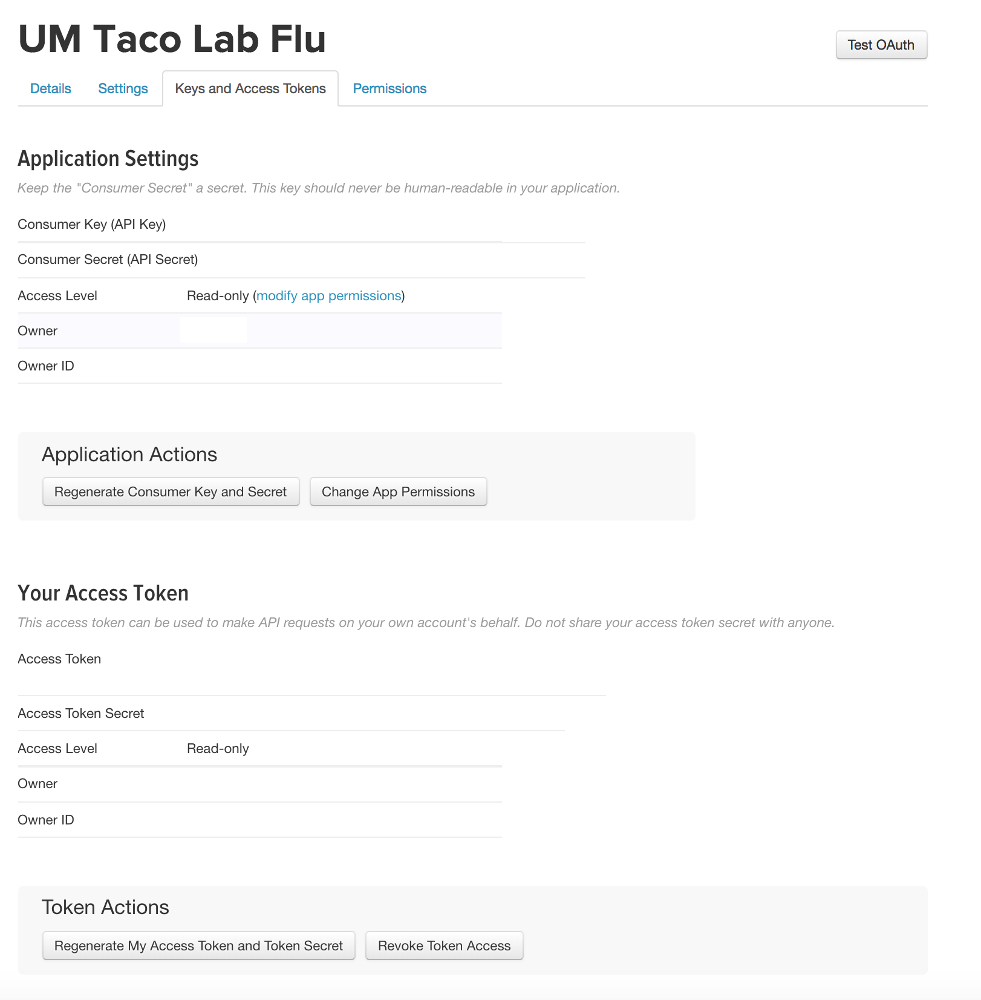
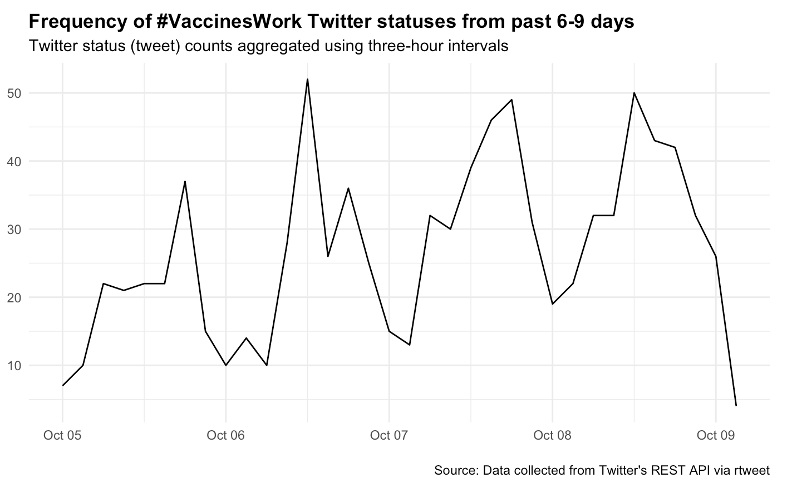
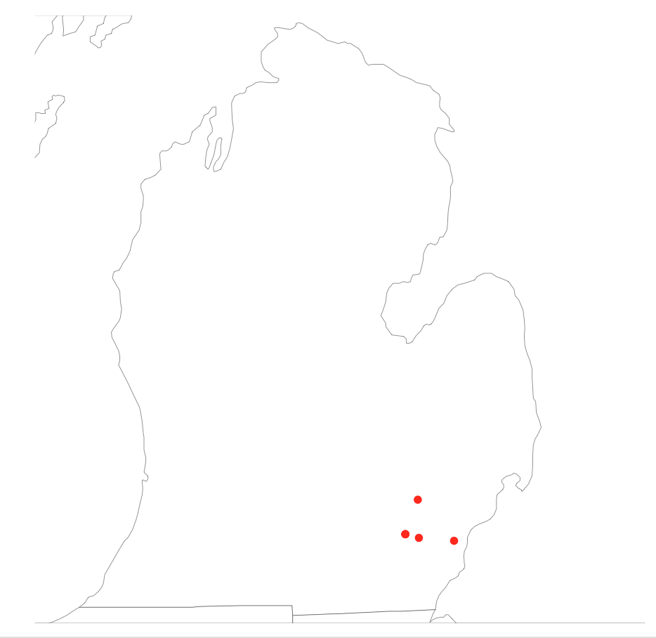

```{r setup, include=FALSE}
knitr::opts_chunk$set(echo = FALSE)
```


## General idea
- Thanks to Yu-Han Kao---adapted some of these materials from her!

### **Data scraping/web scraping**
- Pulling data from the internet (web sites, social media, etc.)
- Involves: crawling/searching, extraction, parsing, reformatting
- Often two general approaches:
    - Directly scraping (note possibly rude---your program/bot(s) will make requests from their server)
    - Use an API!

## What is an API

- **A**pplication **P**rogramming **I**nterface
- A way for programs/software to communicate
- Client/server - can be for web, operating system, databases, etc.
- Web APIs
    - APIs for either web browser or web server
    - Twitter API, Google API, Facebook API...

 
## Using APIs with R
- Many R packages to make this easier: rtweet
    + `twitteR`, `Rfacebook`, `googleAuthR`, `googleAnalyticsR`... 
- Directly using R
<br>
- Python also has very comprehensive libraries (many directly developed by the companies)

<!-- Other interfaces:google map browser apigee--> 

## Getting data from Twitter {.smaller}

- Getting credentials: consumer key & secret, access token & token secret
    + set up Twitter account
    + Create New App - App name, Description, Website, Callback URL: http://127.0.0.1:1410 <br>(127.0.0.1 = localhost, your computer)
<br><br>
     <center></center>
     
## Getting data from Twitter {.smaller}

- Getting credentials: consumer key & secret, access token & token secret
    + set up Twitter account <https://developer.twitter.com/>
    + Create New App
<br><br>    
     <center></center>
     
## Getting data from Twitter {.smaller}

- Getting credentials: consumer key & secret, access token & token secret
    + set up Twitter developer account <https://apps.twitter.com/>
    + Create New App
    + Keys and Access Tokens
    
    <center></center>

## Getting data from Twitter

### **install [rtweet](https://rtweet.info)**

```{r twitter_setup, echo = TRUE, eval=FALSE}
library(rtweet)

# Replace the stuff in quotes with your key, etc.!
create_token(
  app = "Epimath Lab Twitter Data",
  consumer_key = "your consumer key",
  consumer_secret = "your consumer secret",
  access_token = "your token",
  access_secret = "your secret")

```

## Getting data from Twitter
- Pull tweets mentioning a phrase/topic/hashtag 

```{r searchtweets, echo = TRUE, eval=FALSE}
tweetdata = search_tweets("#VaccinesWork", n = 1000, include_rts = FALSE) 
  # try "#VaccinesWork OR #antivax"
```

- Some simple plots included in rtweet, like `ts_plot` for time series
```{r simpleplot, echo = TRUE, eval=FALSE}
tweetdata %>%
  ts_plot("3 hours") +
  ggplot2::theme_minimal() +
  ggplot2::theme(plot.title = ggplot2::element_text(face = "bold")) +
  ggplot2::labs(
    x = NULL, y = NULL,
    title = "Frequency of #VaccinesWork Twitter statuses from past 6-9 days",
    subtitle = "Twitter status (tweet) counts aggregated using three-hour intervals",
    caption = "\nSource: Data collected from Twitter's REST API via rtweet"
  )
```

## Getting data from Twitter
 <center></center>
 
## Getting data from Twitter
- Get followers
```{r followers, echo = TRUE, eval=FALSE}
# Get follower userids
followers = get_followers("epimath", n = 1000) # (can also pass a list of usernames/IDs)

# Get info for these users
follower_info =  lookup_users(followers$user_id)
```
- Get friends (people they follow)
```{r friends, echo = TRUE, eval=FALSE}
friends = get_friends("epimath", n = 1000) 
  # There is a max---can set retryonratelimit = TRUE to overcome this 
  # (but you may have to wait a while!)
friend_info =  lookup_users(friends$user_id)
```

- Build networks this way! (Careful, they grow fast!)

## Getting data from Twitter 

- Get timelines for users (i.e. all the tweets they have posted up to a certain number)
```{r timelines, echo = TRUE, eval=FALSE}
timelines = get_timeline(c("cnn", "BBCWorld", "foxnews"), n = 10) 
  # set max_id to get more tweets without repeating the ones you already pulled 
  # (e.g. if you want to get complete timelines)

  # If you want to see the users home feed, set home = TRUE
```

- Stream live twitter (a pull of what's posting to twitter at this moment)
```{r stream, echo = TRUE, eval=FALSE}
# stream all tweets
stream = stream_tweets(q = "", timeout = 30)

# keyword filter
stream = stream_tweets(q = "NASA", timeout = 30)
```

## Getting data from Twitter 
- Many more functions! `get_retweets`, `get_retweeters`, `get_mentions`, `get_favorites`, `get_trends` etc.
- Can also search users by what's in their bio, what they've tweeted, etc.
- You can also automate posting to whatever account you have signed in with (e.g. to make bots)

## Location information
- If you have a Google Maps API key, you can look up locations automatically (`lookup_coords("Ann Arbor, MI")`)
- But, even if not, relatively easy to get location info:

```{r spatial1, echo = TRUE, eval=FALSE}
# Some places are built in:
USAtweets = stream_tweets(lookup_coords("usa"),timeout = 10)

# Radius around a point (rough center of Ann Arbor from googlemaps)
AAtweets = search_tweets(geocode = "42.276894,-83.728278,10mi", n = 500)

# Can also use shape files, etc. to decide locations
```

- Also, user profiles and tweets can both have locations associated with them---you can get (and search) this info too

## Location information

- Plot maps!

```{r spatial2, echo = TRUE, eval=FALSE}
library(maps)

# add lat/long data to tweets (not all tweets will have this)
AAtweetlocations = lat_lng(AAtweets) 

# plot
map("state", fill = TRUE, col = "#ffffff", 
  lwd = .25, mar = c(0, 0, 0, 0), 
  xlim = c(-87.2, -81.5), y = c(41.7, 45.8))
with(AAtweetlocations, points(lng, lat, pch = 20, col = "red"))
```

## Location information
<center></center>


## Rate limits
- If you use this approach for research, you will likely run into rate limits set by twitter
- Many functions have the option `retryonratelimit = TRUE`
    - But for complicated code, you can still run into limits
- Pause your code occaisionally to avoid bumping into these (e.g. `Sys.sleep(60*2)`)
- `rate_limit()` will check the the limits for all queries you have available (this is a big list, also this can itself hit rate limits...)
- Check a specific rate limit: `rate_limit(query = 'get_timeline')`

<!-- ## Other ways to use APIs -->

<!-- - Python: have very comprehensive libraries (lots of them are directly developed by the companies) -->
<!-- - Your browser: try <http://maps.googleapis.com/maps/api/geocode/json> -->

## Ethics

- Be nice to people...
- Don't make evil bots
- Ask for data nicely
- Reminder that while twitter and other social media/internet data is public, many users don't realize that this means their data can be used for research---they may disclose things (like health status) that they only expect their followers to see. 
    - Be thoughtful about what user data you include in papers, etc.
    - See [here](https://howwegettonext.com/scientists-like-me-are-studying-your-tweets-are-you-ok-with-that-c2cfdfebf135) for a recent commentary on this

<!-- ## Data scraping without APIs -->

<!-- - View page source and inspect -->
<!-- - Simple html: Rcurl + xml or/and RJSONIO -->
<!-- - Somewhat complicated html, or need to do some additional requests (eg. get, post, etc): rvest (scrapeR) -->
<!-- - Fancy websites: rvest+Rselenium -->

## Next!

- What data should we use for projects in the class? Let's brainstorm some interesting data to collect

