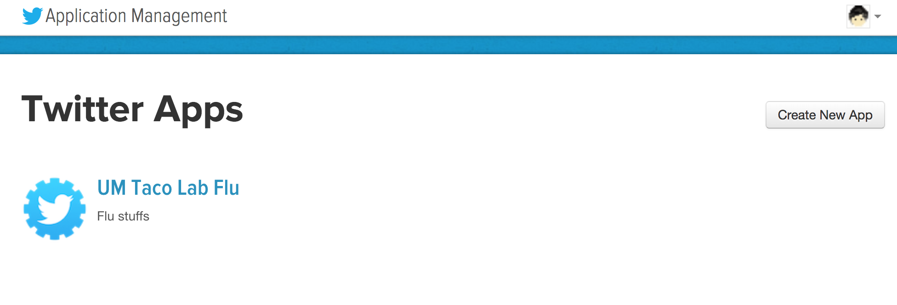
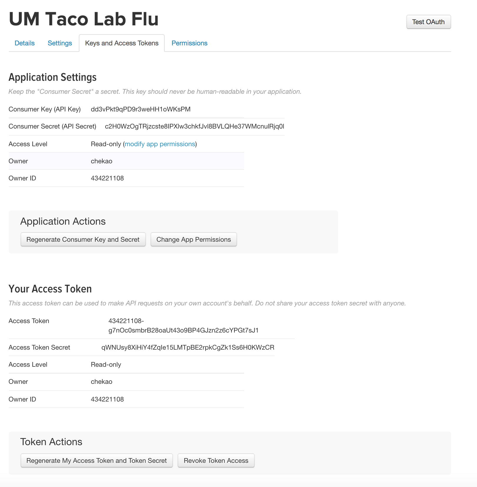

```{r setup, include=FALSE}
knitr::opts_chunk$set(echo = FALSE)
```

## General idea

### **Data scraping/web scraping**
- Crawling
- Extraction: parsing, searching, reformatting...
<br><br>
<center></center>
<br><br><br><br>
<font size="1"> Icon made by Freepik from <http://www.flaticon.com> </font>

## What is an API

- **A**pplication **P**rogramming **I**nterface
    + a way for software to communicate each other
    + restaurant example
<br> <br>

## What is an API

- Web APIs
    + APIs for either web browser or web server
    + Twitter API, Google API, FB API...
    + Expedia example
    <br> <br>
    <center></center>
 
## Using APIs with R
- Using R packages for interacting with specific APIs
    + **twitteR, Rfacebook**, googleAuthR, googleAnalyticsR... 
<br>    
- Directly using R
    + **google map**

<!-- Other interfaces:google map browser apigee--> 

## Getting data from Twitter {.smaller}

- Getting credentials: consumer key & secret, access token & token secret
    + set up Twitter developer account <https://apps.twitter.com/>
<br><br>
     <center></center>
     
## Getting data from Twitter {.smaller}

- Getting credentials: consumer key & secret, access token & token secret
    + set up Twitter developer account <https://apps.twitter.com/>
    + Create New App
<br><br>    
     <center></center>
     
## Getting data from Twitter {.smaller}

- Getting credentials: consumer key & secret, access token & token secret
    + set up Twitter developer account <https://apps.twitter.com/>
    + Create New App
    + Keys and Access Tokens
    
    <center></center>

## Getting data from Twitter

### **install [twitterR](https://www.rdocumentation.org/packages/twitteR/versions/1.1.9)**
<br>
```{r twitter_setup, echo = TRUE, eval=FALSE}
library(twitteR)
### <b>
consumer_key <- "your_consumer_key"
consumer_secret <- "your_consumer_secret"
access_token <- "your_access_token"
access_secret <- "your_access_secret"
### </b>
setup_twitter_oauth(consumer_key, consumer_secret, access_token, access_secret)
```

## Getting data from Twitter {.smaller}

### **following/follower example**
<br>
```{r twitter_scraping, echo = TRUE,eval=FALSE}
seed_user <- getUser('@chekao')
seed_user$getFollowerIDs()

tweets<-searchTwitter('vaccines AND autism', n=3)
target_users<-sapply(tweets, function(x) x$screenName)
target_tweets<-sapply(tweets, function(x) x$getId())
#retweet related functions are buggy, need to report

for (f in 1:length(target_tweets)){
  temp_name<-paste("@", target_users[f], sep="")
  temp_seed<-getUser(temp_name)
  temp_location<-temp_seed$getLocation()
  temp_followers<-try(temp_seed$getFollowerIDs())
  assign(paste(target_users[f],target_tweets[f],sep="_"),c(temp_seed, temp_location, temp_followers))
}

# try different search operators (check twitter search)
```

## Getting data from FB 
- Getting credentials: consumer key & secret, access token & token secret
    + Creating an App <https://developers.facebook.com/>
    + Note: need to fill in the redirect url in fb log-in
    + can only get very limited data (from users who are using the app)
<br><br>
```{r fb_app,echo = TRUE, eval=FALSE}
library(Rfacebook)
fb_oauth <- fbOAuth(
  app_id="your app id",
  app_secret="your app secret",
  extended_permissions = TRUE)

save(fb_oauth, file="token") #next time you can just load the token
#load("token")
```

## Getting data from FB 
- Getting credentials: consumer key & secret, access token & token secret
    + Creating an App <https://developers.facebook.com/>
    + Note: need to fill in the redirect url in fb log-in
    + can only get very limited data (from users who are using the app)
<br><br>
```{r fb_app_conc,echo = TRUE, eval=FALSE}
getUsers("me",token=fb_oauth) #public profile
head(getLikes(user="me", token=fb_oauth)) #likes
updateStatus("hiho", fb_oauth) #fb post via R
#yhk_friends <- getFriends(fb_oauth, simplify = TRUE) #get friends who are using the app
```


## Getting data from FB
- Getting credentials: consumer key & secret, access token & token secret
    + Creating a temporary token through <https://developers.facebook.com/>
    + Less restrictions
    + Only for 2 hrs
<br><br>
```{r fb_temp_token, echo = TRUE, eval=FALSE}
library(Rfacebook)
fb_oauth <- "your own temptoken"
getUsers("me",token=fb_oauth) #public profile
head(getLikes(user="me", token=fb_oauth)) #likes
updateStatus("hiho", fb_oauth) #fb post via R
yhk_friends <- getFriends(fb_oauth, simplify = TRUE)
```

## Getting data from FB
- Getting credentials: consumer key & secret, access token & token secret
    + Creating a temporary token through <https://developers.facebook.com/>
    + Less restrictions
    + Only for 2 hrs
<br><br>
```{r fb_example,echo = TRUE, eval=FALSE}
pages<-getPage("DonaldTrump",fb_oauth,n=5)
target_post<-getPost(pages$id[1], fb_oauth, n=100, likes = TRUE, comments = FALSE)
target_user<-getUsers(target_post$likes$from_id, fb_oauth)
```

## Getting data from google map
<br><br>
```{r googlemap_example,echo = TRUE, eval=FALSE}
# adapted the script from Jose Gonzalez
library(RCurl)
library(RJSONIO)

#write query
query_url<- function(address, return.call = "json", sensor = "false") {
  root <- "http://maps.google.com/maps/api/geocode/"
  u <- paste(root, return.call, "?address=", address, "&sensor=", sensor, sep = "")
  return(URLencode(u))
}
```

## Getting data from google map

```{r googlemap_example_conc1,echo = TRUE, eval=FALSE}
#get and parse json result
geoCode <- function(address,verbose=FALSE) {
  if(verbose) cat(address,"\n")
  u <- query_url(address)
  doc <- getURL(u)
  x <- fromJSON(doc,simplify = FALSE)
  if(x$status=="OK") {
    lat <- x$results[[1]]$geometry$location$lat
    lng <- x$results[[1]]$geometry$location$lng
    location_type  <- x$results[[1]]$geometry$location_type
    formatted_address  <- x$results[[1]]$formatted_address
    return(c(lat, lng, location_type, formatted_address))
    Sys.sleep(0.5)
  } else {
    return(c(NA,NA,NA, NA))
  }
}
```


## Getting data from google map
<br><br>
```{r ooglemap_example_conc2,echo = TRUE, eval=FALSE}
# adapted the script from Jose Gonzalez
library(ggmap)
target_loc <- geoCode("ann arbor sph")
sphmap <- get_map(location = c(lon = as.numeric(target_loc[2]), 
                  lat = as.numeric(target_loc[1])), zoom = 10,
                  maptype = "roadmap", scale = 2)
```


## Other ways to use APIs

- Python: have very comprehensive libraries (lots of them are directly developed by the companies)
- Your browser: try <http://maps.googleapis.com/maps/api/geocode/json>
- Online platforms: try [agigee for twitter](https://apigee.com/console/twitter)

## Ethics

- Be nice to people...
- Don't make evil bots
- Don't flood/block people's servers

## Data scraping without APIs

- View page source and inspect
- Simple html: Rcurl + xml or/and RJSONIO
- Somewhat complicated html, or need to do some additional requests (eg. get, post, etc): rvest (scrapeR)
- Fancy websites: rvest+Rselenium

## Data scraping without APIs

- View page source and inspect
- Simple html: Rcurl + xml or/and RJSONIO
- Somewhat complicated html, or need to do some additional requests (eg. get, post, etc): rvest (scrapeR)
- Fancy websites: rvest+Rselenium
<br><br><br>
<center>**More on Wednesday**</center>


