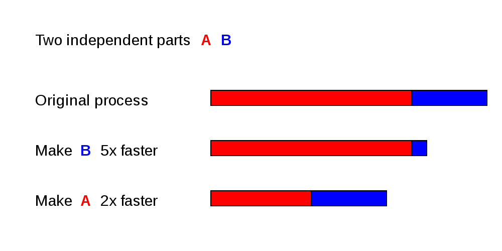

```{r setup, include=FALSE}
knitr::opts_chunk$set(echo = TRUE)
library(reticulate)
```

<!-- ## Outline -->
<!-- - Parallelization - define -->
<!--     - Embarrassingly parallel -->
<!--     - synchronous vs. asynchronous -->
<!-- - Cores, processes, threads -->
<!-- - Parallel computing in python -->
<!-- - Global interpreter lock (GIL) -->
<!-- - introduce multiprocessing---overall idea with processes/workers/pools/etc -->
<!-- Useful links: -->
<!-- https://www.machinelearningplus.com/python/parallel-processing-python/#3whatissynchronousandasynchronousexecution -->
<!-- https://docs.python.org/dev/library/multiprocessing.html -->
<!-- https://sebastianraschka.com/Articles/2014_multiprocessing.html -->
<!-- https://www.geeksforgeeks.org/parallel-processing-in-python/ -->
<!-- https://stackoverflow.com/questions/8533318/multiprocessing-pool-when-to-use-apply-apply-async-or-map -->
<!-- https://stackoverflow.com/questions/43984819/why-this-multiprocessing-code-is-slower-than-the-serial-one -->
<!-- https://www.howtogeek.com/194756/cpu-basics-multiple-cpus-cores-and-hyper-threading-explained/ -->
<!-- https://realpython.com/python-gil/ -->

## Parallel Computing

- Computing where processes are carried out simultaneously

- Break a problem into parts that can be solved separately and recombined

- When figuring out how to parallelize your code, important to think about
    - What portions of your code are taking the most time
    - Dependencies (which parts of the code depend on one another)
    - Potential overhead of parallelization (work-per-task vs. work/overhead of distributing to multiple cores)
    
## Optimizing different parts of code



A 2x speedup in a slower portion of the code may be more helpful than a 5x speedup in a faster portion

<font size="1"> Image from [Wikipedia](https://en.wikipedia.org/wiki/Parallel_computing#/media/File:Optimizing-different-parts.svg) </font>


## Dependencies are important to figure out what can be parallelized

This function can't easily be parallelized:
```{python ex1, eval=FALSE}
def dependentfun(a,b):
  c = a*b
  d = 2*c
  return (c,d)
```

 This one is easier to parallelize because `c` and `d` can be calculated independently:
```{python ex2, eval=FALSE}
def nondependentfun(a,b):
  c = 3*a
  d = 2*b
  return(c,d)
```


## Fine-grained, coarse-grained, and embarrassing parallelism

- **Fine-grained parallelism** - subtasks must communicate/synchronize often (e.g. many times/second)

- **Coarse-grained parallelism** - subtasks communicate infrequently

- **Embarrassingly parallel** - subtasks can be completed largely or entirely independently
    - Common for complex systems models! Running a model for multiple different parameter values/initial conditions/etc. is often embarrassingly parallel
    - This often shows up in places where we need to run a for loop over a bunch of different parameter values, where each run can be evaluated largely independently

## Common parallel computers in scientific computing

- **Multi-core computers** (e.g. your laptop probably) - have multiple CPUs (central processing units) on the same chip

- **Cluster computing** (e.g. Great Lakes) - multiple computers networked together so they can share information rapidly (e.g. for parallel tasks that require synchronization or sharing of information)

- **Grid computing** - computers communicate over the internet to solve parallel problems (e.g. Seti@Home) - usually only for embarrassingly parallel problems

- **GPU (Graphics Processing Unit) computing** - particularly useful if you have extremely parallel computations that don't need a lot of memory per task, large matrix computations (particularly if the spatial location of the memory storage can be taken advantage of), etc.


## CPU's, cores, and hyperthreading
- **CPU** - Central Processing Unit, executes computer program instructions

- **Multi-core processors** - contain multiple CPU's within the same chip

- **Hyperthreading** - allows each core to run two virtual 'cores' - the operating system sees two cores even though there is actually only one physical core. 
    - Typically slower than two actual cores but faster than a single core.


## Parallelization in R: doParallel and foreach

- Allows you to register cores on your computer as a cluster

- Can then run parallel computations using `foreach`

- Mainly used for for loops, but can do other things (apply, etc)

- Example: https://gist.github.com/marisae/fd81e0b4468c4647c7420f26833ae22f

## Parallelization in Python: the Multiprocessing Module
- **Global interpreter lock (GIL)** - allows only one thread to control the python interpreter at a time. This is helpful for memory management & avoiding memory leaks, but makes it difficult to do parallelization.

- The `multiprocessing` module gets around this by using multiple processes instead of multiple threads---essentially, rather than trying to let multiple parallel tasks run within a single python interpreter, `multiprocessing` has each task get its own python interpreter so they won't interfere. 
    - However, note that because each process gets its own interpreter, the overhead for parallelization can be large

<!-- Processes vs. threads---both are parallel tasks but processes tend to be bigger, more independent, while threads are more lightweight & can communicate more -->
<!-- Nice clear explainer for this: https://realpython.com/python-gil/ -->
<!-- The GIL is helpful for memory management, since python keeps track of how many things reference/access and element and releases the memory when this hits 0. But if multithreaded then could have a race condition where the refcount is incorrectly increased/decreased because threads are both accessing it at the same time---could e.g lead to memory being released when it's still being used, etc. -->
<!-- ```{python ex3, eval=FALSE} -->
<!-- import sys -->
<!-- a = [] -->
<!-- b = a -->
<!-- sys.getrefcount(a) -->
<!-- ``` -->

## Example of two processes with multiprocessing

```{python processes,eval=FALSE}
def myfunction(a,b):
  print(a,"and also",b)

# Set up the two processes
p1 = mp.Process(target=myfunction, args=("cats", "dogs"))
p2 = mp.Process(target=myfunction, args=("stuff","more stuff"))
  
# start them
p1.start()
p2.start()
  
# the join command makes the code wait until the process is done
p1.join()
p2.join()
```

## Setting up a pool of cores

- However, more commonly, we'll have a list or array of tasks to complete (e.g. run the model for a large list of parameter sets)

- Rather than setting up a process for each, we can set up a pool of cores/processors and give the pool tasks to run

- The `apply`, `map`, and `starmap` functions allow you to give tasks to the pool conveniently for tasks that you would usually use a loop for in a non-parallel setting (e.g. an list/array of tasks to complete)

## Synchronous & asynchronous parallelization

The `apply`, `map`, and `starmap` functions in `multiprocessing` can be run synchronously or asynchronously:

- **Synchronous** - parallel tasks are completed in their original order, and the program is locked/on hold until each piece is complete
    - e.g. if we have a list of 5 parameter sets to run a model for, and we want the results in order, then the next parameter set results can't be written until the one before it is finished.

- **Asynchronous** - parallel tasks are completed in whatever order is convenient. Processes don't wait for each other to continue on to the next task. 
    - Often faster, however may return results out of order (e.g. might return a scrambled order of parameter runs rather than the order provided---this can often be resolved by recording the index, see examples below)

## Example 

```{python pool, eval=FALSE}
import multiprocessing as mp

# Check how many cores you have
print("Number of processors: ", mp.cpu_count())

poolsize = mp.cpu_count()-1 # I usually leave one core free if I'm on my laptop

# Initialize our pool of cores
pool = mp.Pool(poolsize) 

# Use pool.apply to run the model on all of our N values
results = [pool.apply(myfunction, args=(word,"Marisa")) for word in WordList]

# Close the pool once we're done
pool.close()  
```


## Let's try it out!

- https://replit.com/@EisenbergUM/ParallelizationExample#main.py